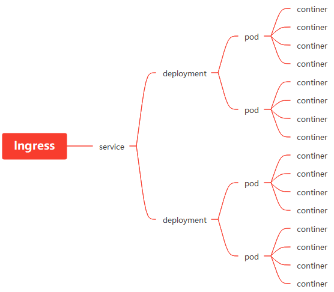

# k8s笔记

## k8s大体架构



```text
docker run -d \
  --restart=unless-stopped \
  --name=kuboard \
  -p 80:80/tcp \
  -p 10081:10081/tcp \
  -e KUBOARD_ENDPOINT="http://192.168.1.34:80" \
  -e KUBOARD_AGENT_SERVER_TCP_PORT="10081" \
  -v /root/kuboard-data:/data \
  eipwork/kuboard:v3
```

```yml
apiVersion: v1
kind: Namespace
metadata: 
  name: test
```

```yml
apiVersion: v1
kind: Pod
metadata: 
  name: nginx-yml
  namespace: test
spec: 
  containers: 
  - image: nginx:latest 
    name: nginx-yml
```

```yml
apiVersion: v1
kind: Pod
metadata: 
  name: nginx-yml
  namespace: test
spec: 
  containers: 
  - image: nginx:latest 
    name: nginx-yml
    imagePullPolicy: IfNotPresent
```

## 国内containered配置

```
disabled_plugins = []
imports = []
oom_score = 0
plugin_dir = ""
required_plugins = []
root = "/var/lib/containerd" # 容器存放路径，确保可用空间充足
state = "/run/containerd"
version = 2

[cgroup]
  path = ""

[debug]
  address = ""
  format = ""
  gid = 0
  level = ""
  uid = 0

[grpc]
  address = "/run/containerd/containerd.sock"
  gid = 0
  max_recv_message_size = 16777216
  max_send_message_size = 16777216
  tcp_address = ""
  tcp_tls_cert = ""
  tcp_tls_key = ""
  uid = 0

[metrics]
  address = ""
  grpc_histogram = false

[plugins]

  [plugins."io.containerd.gc.v1.scheduler"]
    deletion_threshold = 0
    mutation_threshold = 100
    pause_threshold = 0.02
    schedule_delay = "0s"
    startup_delay = "100ms"

  [plugins."io.containerd.grpc.v1.cri"]
    disable_apparmor = false
    disable_cgroup = false
    disable_hugetlb_controller = true
    disable_proc_mount = false
    disable_tcp_service = true
    enable_selinux = false
    enable_tls_streaming = false
    ignore_image_defined_volumes = false
    max_concurrent_downloads = 3
    max_container_log_line_size = 16384
    netns_mounts_under_state_dir = false
    restrict_oom_score_adj = false
    sandbox_image = "registry.cn-hangzhou.aliyuncs.com/google_containers/pause:3.6"
    selinux_category_range = 1024
    stats_collect_period = 10
    stream_idle_timeout = "4h0m0s"
    stream_server_address = "127.0.0.1"
    stream_server_port = "0"
    systemd_cgroup = false
    tolerate_missing_hugetlb_controller = true
    unset_seccomp_profile = ""

    [plugins."io.containerd.grpc.v1.cri".cni]
      bin_dir = "/opt/cni/bin"
      conf_dir = "/etc/cni/net.d"
      conf_template = "/etc/cni/net.d/cni-default.conf"
      max_conf_num = 1

    [plugins."io.containerd.grpc.v1.cri".containerd]
      default_runtime_name = "runc"
      disable_snapshot_annotations = true
      discard_unpacked_layers = false
      no_pivot = false
      snapshotter = "overlayfs"

      [plugins."io.containerd.grpc.v1.cri".containerd.default_runtime]
        base_runtime_spec = ""
        container_annotations = []
        pod_annotations = []
        privileged_without_host_devices = false
        runtime_engine = ""
        runtime_root = ""
        runtime_type = ""

        [plugins."io.containerd.grpc.v1.cri".containerd.default_runtime.options]

      [plugins."io.containerd.grpc.v1.cri".containerd.runtimes]

        [plugins."io.containerd.grpc.v1.cri".containerd.runtimes.runc]
          base_runtime_spec = ""
          container_annotations = []
          pod_annotations = []
          privileged_without_host_devices = false
          runtime_engine = ""
          runtime_root = ""
          runtime_type = "io.containerd.runc.v2"

          [plugins."io.containerd.grpc.v1.cri".containerd.runtimes.runc.options]
            BinaryName = ""
            CriuImagePath = ""
            CriuPath = ""
            CriuWorkPath = ""
            IoGid = 0
            IoUid = 0
            NoNewKeyring = false
            NoPivotRoot = false
            Root = ""
            ShimCgroup = ""
            SystemdCgroup = true

      [plugins."io.containerd.grpc.v1.cri".containerd.untrusted_workload_runtime]
        base_runtime_spec = ""
        container_annotations = []
        pod_annotations = []
        privileged_without_host_devices = false
        runtime_engine = ""
        runtime_root = ""
        runtime_type = ""

        [plugins."io.containerd.grpc.v1.cri".containerd.untrusted_workload_runtime.options]

    [plugins."io.containerd.grpc.v1.cri".image_decryption]
      key_model = "node"

    [plugins."io.containerd.grpc.v1.cri".registry]
      config_path = ""

      [plugins."io.containerd.grpc.v1.cri".registry.auths]

      [plugins."io.containerd.grpc.v1.cri".registry.configs]

      [plugins."io.containerd.grpc.v1.cri".registry.headers]

      [plugins."io.containerd.grpc.v1.cri".registry.mirrors]
        [plugins."io.containerd.grpc.v1.cri".registry.mirrors."docker.io"]
          endpoint = ["https://docker.mirrors.ustc.edu.cn", "http://hub-mirror.c.163.com"]
        [plugins."io.containerd.grpc.v1.cri".registry.mirrors."gcr.io"]
          endpoint = ["https://gcr.mirrors.ustc.edu.cn"]
        [plugins."io.containerd.grpc.v1.cri".registry.mirrors."k8s.gcr.io"]
          endpoint = ["https://gcr.mirrors.ustc.edu.cn/google-containers/"]
        [plugins."io.containerd.grpc.v1.cri".registry.mirrors."quay.io"]
          endpoint = ["https://quay.mirrors.ustc.edu.cn"]

    [plugins."io.containerd.grpc.v1.cri".x509_key_pair_streaming]
      tls_cert_file = ""
      tls_key_file = ""

  [plugins."io.containerd.internal.v1.opt"]
    path = "/opt/containerd"

  [plugins."io.containerd.internal.v1.restart"]
    interval = "10s"

  [plugins."io.containerd.metadata.v1.bolt"]
    content_sharing_policy = "shared"

  [plugins."io.containerd.monitor.v1.cgroups"]
    no_prometheus = false

  [plugins."io.containerd.runtime.v1.linux"]
    no_shim = false
    runtime = "runc"
    runtime_root = ""
    shim = "containerd-shim"
    shim_debug = false

  [plugins."io.containerd.runtime.v2.task"]
    platforms = ["linux/amd64"]

  [plugins."io.containerd.service.v1.diff-service"]
    default = ["walking"]

  [plugins."io.containerd.snapshotter.v1.aufs"]
    root_path = ""

  [plugins."io.containerd.snapshotter.v1.btrfs"]
    root_path = ""

  [plugins."io.containerd.snapshotter.v1.devmapper"]
    async_remove = false
    base_image_size = ""
    pool_name = ""
    root_path = ""

  [plugins."io.containerd.snapshotter.v1.native"]
    root_path = ""

  [plugins."io.containerd.snapshotter.v1.overlayfs"]
    root_path = ""

  [plugins."io.containerd.snapshotter.v1.zfs"]
    root_path = ""

[proxy_plugins]

[stream_processors]

  [stream_processors."io.containerd.ocicrypt.decoder.v1.tar"]
    accepts = ["application/vnd.oci.image.layer.v1.tar+encrypted"]
    args = ["--decryption-keys-path", "/etc/containerd/ocicrypt/keys"]
    env = ["OCICRYPT_KEYPROVIDER_CONFIG=/etc/containerd/ocicrypt/ocicrypt_keyprovider.conf"]
    path = "ctd-decoder"
    returns = "application/vnd.oci.image.layer.v1.tar"

  [stream_processors."io.containerd.ocicrypt.decoder.v1.tar.gzip"]
    accepts = ["application/vnd.oci.image.layer.v1.tar+gzip+encrypted"]
    args = ["--decryption-keys-path", "/etc/containerd/ocicrypt/keys"]
    env = ["OCICRYPT_KEYPROVIDER_CONFIG=/etc/containerd/ocicrypt/ocicrypt_keyprovider.conf"]
    path = "ctd-decoder"
    returns = "application/vnd.oci.image.layer.v1.tar+gzip"

[timeouts]
  "io.containerd.timeout.shim.cleanup" = "5s"
  "io.containerd.timeout.shim.load" = "5s"
  "io.containerd.timeout.shim.shutdown" = "3s"
  "io.containerd.timeout.task.state" = "2s"

[ttrpc]
  address = ""
  gid = 0
  uid = 0
```

### 生成默认模块配置文件
```bash
containerd config default > /etc/containerd/config.toml
```

## k8s常用命令

- containered
```bash
  ctr c create docker.io/library/nginx:latest nginx1
  ctr c delete nginx1
  ctr c ls
  ctr c rm nginx2
  ctr --help
  ctr images
  ctr images delete docker.io/library/nginx:latest
  ctr images export ngx.img docker.io/library/nginx:latest
  ctr images export ngx.img --platform linux/amd64 docker.io/library/nginx:latest
  ctr images --help
  ctr images import --help
  ctr images import ngx.img
  ctr images ls
  ctr images mount docker.io/library/nginx:latest /mnt
  ctr images pull docker.io/library/nginx:latest
  ctr images pull --help
  ctr images pull --platform linux/amd64  docker.io/library/nginx:latest
  ctr run -d --net-host docker.io/library/nginx:latest nginx2
  ctr run --help
  ctr task delete nginx1
  ctr task exec --exec-id $RANDOM nginx1 /bin/bash
  ctr task exec --exec-id $RANDOM nginx1 /bin/sh
  ctr task --help
  ctr task kill nginx2
  ctr task ls
  ctr task start -d nginx1
```

 containerd 端口映射的问题？


- docker