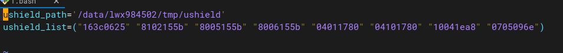
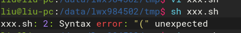

# questions
- 问题描述

这个脚本只能用bash执行，用sh执行报错

现在有个场景是必须用sh来执行，不能用bash，要怎么改脚本

解决方法
```bash
ushield_list=`echo "163c0625" "8102155b" "8005155b" "8006155b" "04011780" "04101780" "10041ea8" "0705096e" `
for i in $ushield_list
do
echo $i
done
```
